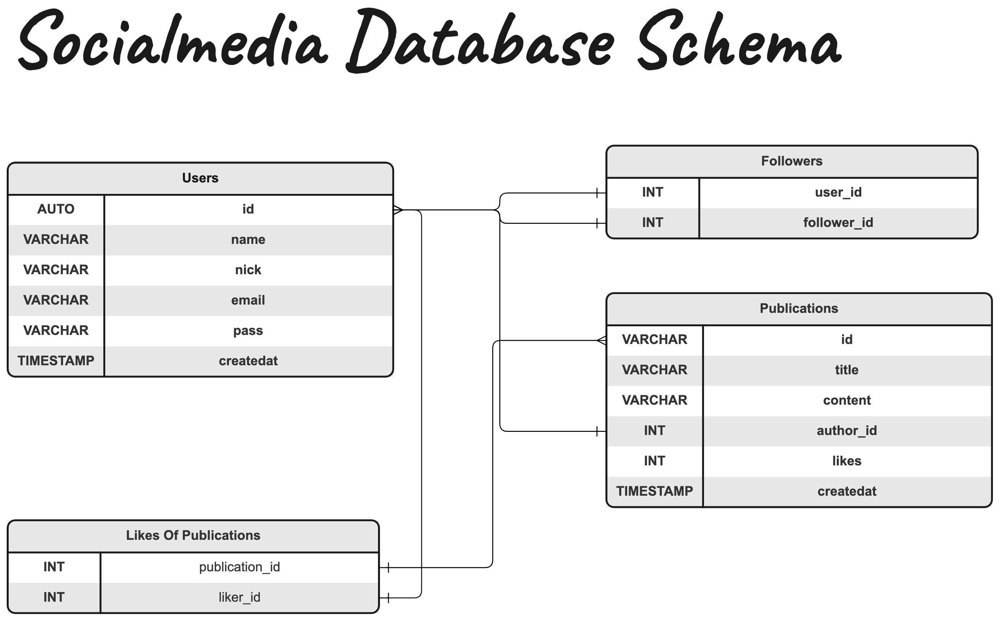

> Documentation of socialmedia api service

The database schema representation:

## Business Functionalities:

### Publication:

- Create a publication
- Retrieve publications
- Retrieve a specific publication
- Update a publication
- Delete a publication
- Retrieve all publications from specific user
- Like an publication
- Unlike an publication
- Retrieve all users who liked your publication

### Users:

- Create a user
- Delete a user
- Retrieve a set of users by email
- Retrieve a specific user
- Update a user attributes
- Delete a user
- Follow a user
- Unfollow a user
- Retrieve the user followers
- Retrieve who a user is following
- Update user password
- Retrieve all publications a user liked

### Login:

- The API returns an JWT generated token with expiration date to call the backend service

### Healthcheck

- The API performs two bases of healthchecks:

    1. `/live` endpoint performs a fake database insertion to know if the main functionalities can be performed
    2. `/ready` endpoint performs a TCP connection and DNS resolution to the database to know if the main functionalities can be performed

### Middleware

- Authenticates the user into the system
- Logs into STDOUT all the requests performed to the api
- Perform a mensure of the time tooked to process the request (and generate the timeseries prometheus metric)

### Security

- Hashes the users passwords
- Validates the users passwords

### Authentication

- Generate the users token
- Validate the user given token with JWT
